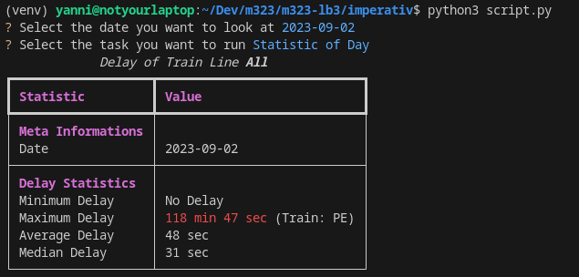
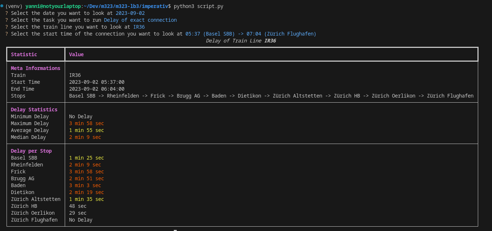
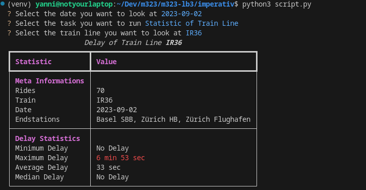
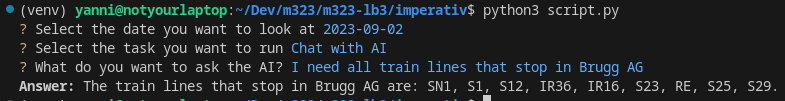

# m323-lb3

## Inhalt

- [m323-lb3](#m323-lb3)
  - [Inhalt](#inhalt)
  - [Wahl der imperativen Programmiersprache](#wahl-der-imperativen-programmiersprache)
    - [Wahl der Programmiersprache](#wahl-der-programmiersprache)
    - [Funktionale Elemente](#funktionale-elemente)
      - [Map](#map)
      - [Oder mit List Comprehension](#oder-mit-list-comprehension)
      - [Filter](#filter)
      - [Oder mit List Comprehension](#oder-mit-list-comprehension-1)
      - [Reduce](#reduce)
      - [List Comprehension Kombination aus map und filter](#list-comprehension-kombination-aus-map-und-filter)
  - [Projektantrag](#projektantrag)
  - [Output](#output)
    - [Statistik eines bestimmten Tags](#statistik-eines-bestimmten-tags)
    - [Statistik einer bestimmten Zuglinie](#statistik-einer-bestimmten-zuglinie)
    - [Statistik einer bestimmten Zugverbindung](#statistik-einer-bestimmten-zugverbindung)
    - [Statistik über Chat mit AI](#statistik-über-chat-mit-ai)
  - [Fazit](#fazit)
    - [Nutzen der funktionalen Elemente im Projekt:](#nutzen-der-funktionalen-elemente-im-projekt)
    - [Vereinfachung durch das Refactoring:](#vereinfachung-durch-das-refactoring)
    - [Wiederholte Verwendung funktionaler Elemente:](#wiederholte-verwendung-funktionaler-elemente)
    - [Anwendungsfälle funktionaler Sprachelemente im Betrieb:](#anwendungsfälle-funktionaler-sprachelemente-im-betrieb)

<br>

## Wahl der imperativen Programmiersprache

### Wahl der Programmiersprache

Als wir die imperative Programmiersprache gewählt haben, entschieden wir uns für [Python](https://www.python.org/), da man in Python sowohl imperativ als auch funktional programmieren kann. Python bietet 2 verschiedene Möglichkeiten um funktional zu Programmieren. Zum einen kann man die relative bekannten Funktionalen Elemente wie `map()` oder `filter()` verwenden. Allerdings hat Python auch einen sehr speziellen Syntax mit dem man einfach funktional Listen, Dictionarys (In anderen Programmiersprachen oft als Map bekannt) und Sets zu bearbeiten. Der Syntax erinnerst stark an einen sehr änlichen Syntaxt aus Haskell mit dem man auch Listen bearbeiten kann 

### Haskell

```haskell
[x * 2 | x <- [1..10], isEven x]

```

### Python

```python
[x * 2 for x in range(1, 11) if not (x % 2)]
```

Zudem bietet Pandas viele bekannte Libraries wie [NumPy](https://numpy.org/) oder auch [Pandas](https://pandas.pydata.org/) mit denen man leicht Daten laden, analysieren, bearbeiten und schliesslich auch auswerten kann. Wir haben uns allerdings dafür entschieden diese Library nur im imperativen Teil zu verwenden, da der Sinn des Projektes nicht darin besteht im Funktionalen Teil einfach die ganze Arbeit von einer Library durchzuführen.

<br>

### Funktionale Elemente

Folgend sind diverse funktionale Elemente, die in Python verwendet werden können, jeweils mit Beispiel und kurzer Beschreibung aufgeführt.

<br>

#### Map
```python
test_array = [1, 2, 3, 4, 5, 6, 7, 8, 9]

squared = list(map(lambda x: x**2, test_array))
print(squared)
```

Map wendet eine Operation auf jedes Element einer Liste an. 

<br>

#### Oder mit List Comprehension
```python
test_array = [1, 2, 3, 4, 5, 6, 7, 8, 9]

squared = [x**2 for x in test_array]
print(squared)
```

List Comprehension kann als Alternative von Map verwendet werden. In Python ist es sinvoller List Comprehension als Map zu verwenden.

<br>

#### Filter
```python
test_array = [1, 2, 3, 4, 5, 6, 7, 8, 9]

even = list(filter(lambda x: x % 2 == 0, test_array))
```

Filter geht jedes Element einer Liste durch und schreibt die Elemente, welche die Bedingung des Filters erfüllen, in eine neue Liste.

<br>

#### Oder mit List Comprehension
```python
test_array = [1, 2, 3, 4, 5, 6, 7, 8, 9]

even = [x for x in test_array if x % 2 == 0]
```

List Comprehension kann neben Alternative von Map ebenfalls als Alternative von Filter verwendet werden. In Python ist es sinvoller List Comprehension als Filter zu verwenden.

<br>

#### Reduce
```python
test_array = [1, 2, 3, 4, 5, 6, 7, 8, 9]

from functools import reduce
sum = reduce(lambda x, y: x + y, test_array)
print(sum)
```

Reduce fasst alle Werte einer Liste in einem Wert zusammen, z.B. die Summe aller Werte (sum).

<br>

#### List Comprehension Kombination aus map und filter
```python
test_array = [1, 2, 3, 4, 5, 6, 7, 8, 9]

even_squared = [x**2 for x in test_array if x % 2 == 0]
```

Der Vorteil von List Comprehension in Python ist, dass man Filter und Map zusammen kombinieren kann.

<br>

## Projektantrag

Der Projektantrag kann (von den dafür berechtigten Personen) über [diesen Link](https://drive.google.com/file/d/18z_Anoh4hKjiHOTmGllTRD2MPA4C1zwL/view?usp=sharing) angesehen werden.

<br>

## Output

Der Output sieht sowohl beim imperativen Programm, als auch beim funktionalen Programm, gleich aus. <br>
Oben in den Screenshots sieht man jeweils die Inputs im [CLI](https://en.wikipedia.org/wiki/Command-line_interface) und unterhalb sieht man jeweils den Output. <br>

### Statistik eines bestimmten Tags


### Statistik einer bestimmten Zuglinie


### Statistik einer bestimmten Zugverbindung


### Statistik über Chat mit AI


<br>

## Fazit

### Nutzen der funktionalen Elemente im Projekt:

Die funktionalen Elemente haben in unserem Projekt keinen bedeutsamen Nutzen. Sie sind schwerer zu lesen und die Ausführung ist deutlich langsamer im Vergleich zur imperativen Version. Dies liegt daran, dass der Code nicht in C geschrieben wurde.

### Vereinfachung durch das Refactoring:

Das Refactoring hat, wie oben beschrieben, kaum Vorteile gebracht. Im Gegenteil, sowohl die Performance als auch die Lesbarkeit haben darunter gelitten.

### Wiederholte Verwendung funktionaler Elemente:

Wir würden nur wenige Elemente erneut verwenden und das auch nur dann, wenn es wirklich sinnvoll ist. Falls, dann würden wir List Comprehension verwenden.

### Anwendungsfälle funktionaler Sprachelemente im Betrieb:

Wir sehen keine bedeutenden Anwendungsfälle in unserem Betrieb. Wir sind uns jedoch nicht sicher, wie unser System aufgebaut ist und wo & wie funktionale Elemente eventuell genutzt werden könnten.
